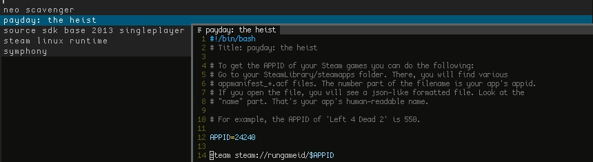

# taverner



## INTRODUCTION

Taverner is a shell script designed
to generate and maintain a bunch of game launchers (or anything else
really). You can use it together with dmenu and have it 
launch your apps.

## REQUIRES

- bash 4.2+

## INSTALL

* Source

```bash
$ git clone https://github.com/vagos/taverner
$ cd taverner && sudo make DESTDIR="/usr/bin/" install
```

* Arch Linux

taverner is on the aur as [taverner-git](https://aur.archlinux.org/packages/taverner-git)

```bash
# Install using yay
yay -S taverner-git
```

## CONFIG

Configuration is placed in ```XDG_CONFIG_HOME/taverner``` or 
in ```$HOME/.config/taverner``` edit the file ```menu``` to 
set the command for your preferred launch menu. 

We recommend [dmenu](https://github.com/stilvoid/dmenu).

## USAGE

Briefly, a typical session may look like this

```bash
$ taverner bk -h
Usage: barkeep [-h] [mk | ls | ed | rm]
    Each mode has an -h flag which produces a summary of its help section.

    -e      Preferred editor, uses $EDITOR if not set.

Create a new menu entry.  Uses $EDITOR to complete the new entry.

    mk [-c <cover>] -t <template> <entry>
        -t      Select a template to base the new entry on.
        -c      Path or url to a cover image.  (Note: This is destructive)
        entry   The name for the new launcher script.

List entries and templates.
    ls [-t]
        -t      List all available templates.

        If no arguments given this will list all entries.

Edit the selected entry or template.  Only one entry may be edited per
invocation.

    ed [-t <template>] [-c <cover>] [entry]
        -t      Attempts to open the template with $EDITOR.
        -c      Replace the cover for entry, note that the entry is required
                for this operation.
        entry   Attempts to open the entry with $EDITOR.

    Issue: If -c is specified for an entry, it will both update the entries
           cover image but also offer to edit the entry as well.

Remove selected entries and corresponding covers.  If no argument given,
attempt to remove all entires.

    rm [entry [entry]]
        entry   The chosen entry to remove.

Examples:
    # Creates an entry using the psx template called wipeout_3 using emacs
    # as the editor.
    taverner bk mk -e emacs -t psx wipeout_3

    # Removes both wipeout_3 and crash_bandicoot launchers along with any
    # cover images if found.
    taverner bk rm wipeout_3 crash_bandicoot

$ taverner bk ls -t
ppsspp
wine

$ taverner mk wipeout_pulse -t ppsspp -c ~/wipeout_pulse_cover.jpg
‘/home/earnest/wipeout_pure_cover.jpg’ -> ‘/home/earnest/local/data/taverner/covers/wipeout_pure’
‘/home/earnest/local/data/taverner/templates/ppsspp’ -> ‘/home/earnest/local/data/taverner/bin/wipeout_pure’
```

At this point you'll get prompted with your editor to make any changes
to the template such as specifying what to execute, and where the data
files are located. Here is an example template with places left for you
to fill in:

```bash
#!/bin/bash
# Title: Wipeout Pure (PSP 2005)

ppsspp --fullscreen "$LOCALDIR"/data/games/psp/wipeout_pure.iso
```

Here the title is read and passed to dmenu, if "# Title:" isn't present,
taverner will fallback on the file name of the launch script.

After editing the template, run taverner.

Obviously, you can just add whatever files you want in the __taverner/bin__
folder without using any of the __taverner bk__ commands. 
Think of __taverner bk__ as just a utility to manage your templates for
various different game/app launchers.

### Automatically load games

Available are also some scripts to automatically add the necessary __taverner/bin__ files
from a specific platform. You can find them in the
[util](https://github.com/vagos/taverner/tree/master/util) folder in this repo.

Platforms Supported:

* Steam

## WHY

  I wanted to turn an old machine into a game box that could play various
  emulated games on the SNES, PSX, PSP and some older ones via WINE while
  unifying the UI. Many existing solutions were quite sophisticated,
  beautiful but complex graphical frontends, usually existing to serve a
  specific set of emulators.

  Since the machine I was planning to use is quite limited in terms of
  hardware I wanted something simple (and not very clever) which did as
  little as possible and with enough flexibility for anything I might
  conceivably throw at it.

  Initially I simply wrote a few lines of shell that passed a handwritten
  list to dmenu which launched a second script that contained all the
  logic necessary for starting the program. Eventually this manual
  insertion and deletion of list entries became inconvenient which
  resulted in the creation of the `taverner` script that generates menus
  on the fly.

  Now that was reasonably well solved, I still had the issue of manually
  writing the launcher scripts and setting up the cover image along with
  other potential tweaks. This is where `barkeep` comes in, it exists
  simply to aid me in creating the launchers, copying over templates and
  letting me just add any necessary tweaks.
